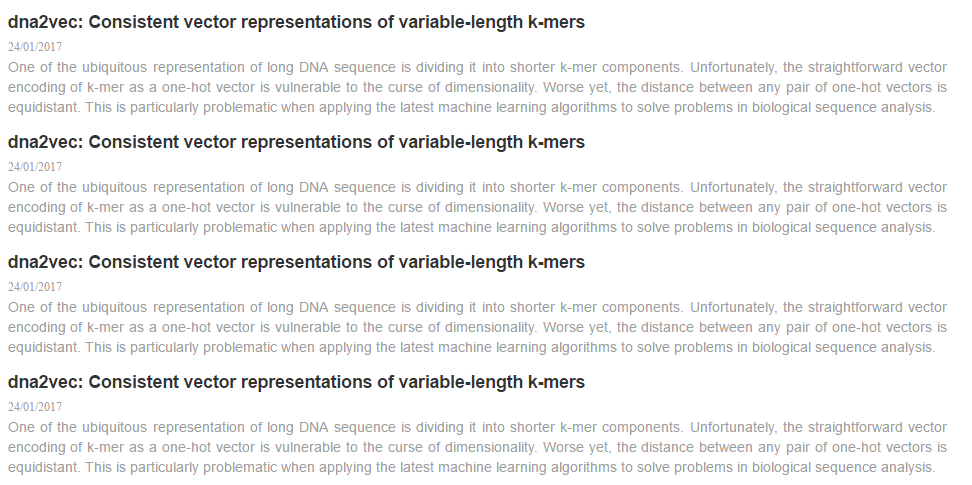

## magiz-c-feed: Feed Component UI


### Installation

```
bower install magiz-c-feed
```

### Usage

Insert scripts and styles in `index.html`

```html
<link rel="stylesheet" href="./src/feed.css">

<script src="./src/gspreadsheet.js"></script>
<script src="./src/feed.js"></script>
```

Add feed dom to your html

```
<div class="feeds" gid="1zEcae1--KnPmoK9GH3brsZSqNjbGR-Xa0ONpZ1VFGpA"></div>
```

Result


